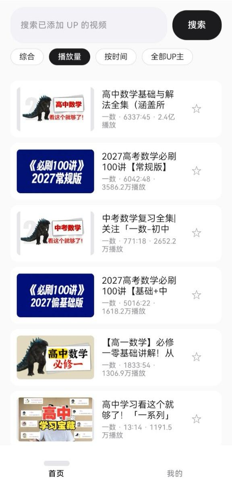
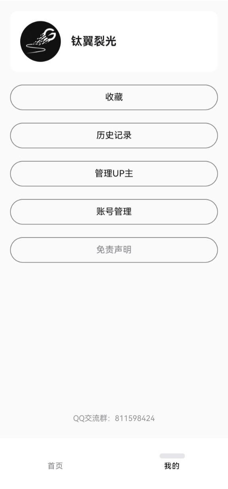
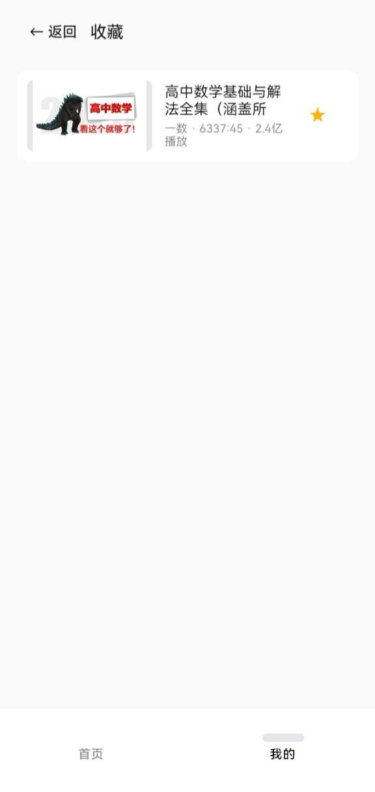
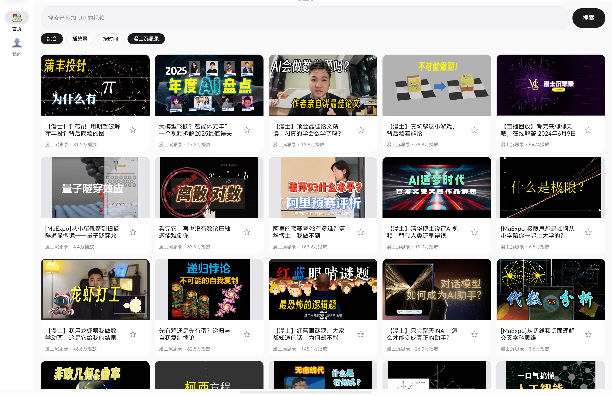

# BiliLite

> 学习专注型 B 站第三方客户端 —— 黑白极简,为深度学习而生

BiliLite 不是"更好的 B 站客户端",而是**用 B 站内容作为学习素材的专注工具**。所有设计服务于深度学习,从根源上拒绝娱乐。

## ✨ 功能特性

- 📱 **专注机制**:无评论区、无弹幕、无小窗播放、无后台播放、无自动连播,退出即暂停
- 🔍 **UP 主管理**:搜索添加 UP 主(显示粉丝数防选错),自定义分类标签,按标签筛选
- 🔒 **专注密码**:6 位数字密码保护 UP 主管理,不可找回
- 📺 **双模式**:快速浏览 / 深度学习(精读模式要求写一句话总结才能标记完成)
- 📚 **待学习队列**:收藏进入队列,观看 >95% 进入已学习队列,自动识别分P系列(已学 X/Y 集)
- 📊 **学习复盘**:周/月极简学习报告(学习时长/视频数/标签分布/平均完成度)
- 🎨 **视觉**:纯黑白极简,圆角线条,苹果风格,无彩色干扰

## 📱 界面预览

### 手机端效果

<table>
  <tr>
    <td align="center"><br><b>首页</b><br>视频列表 · 搜索筛选</td>
    <td align="center"><br><b>我的</b><br>个人中心 · 收藏/历史</td>
    <td align="center"><br><b>收藏页</b><br>收藏视频列表</td>
  </tr>
</table>

### 平板端效果

<table>
  <tr>
    <td align="center"><br><b>视频播放页</b><br>播放器 + 分P/章节列表</td>
    <td align="center"><br><b>首页(横屏)</b><br>网格布局视频列表</td>
  </tr>
</table>

## 🛠 技术栈

- Kotlin + Jetpack Compose(单 Activity,底部三 Tab)
- Room(成绩/公式库持久化)
- B 站网页 API(wbi 签名)
- minSdk 24 / targetSdk 35

## 🔨 构建

```bash
export ANDROID_HOME=/opt/android-sdk
./gradlew assembleDebug
# 产物: app/build/outputs/apk/debug/app-debug.apk
```

## ⚠️ 声明

- 非官方客户端,仅用于个人学习
- B 站数据通过网页 API + 用户 Cookie(SESSDATA)获取,请勿频繁请求,风险自负
- 登录凭据仅保存在本地
